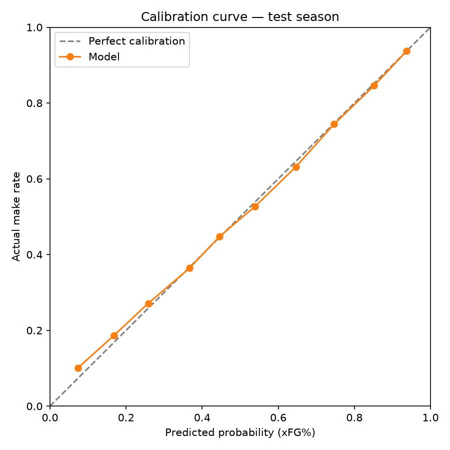
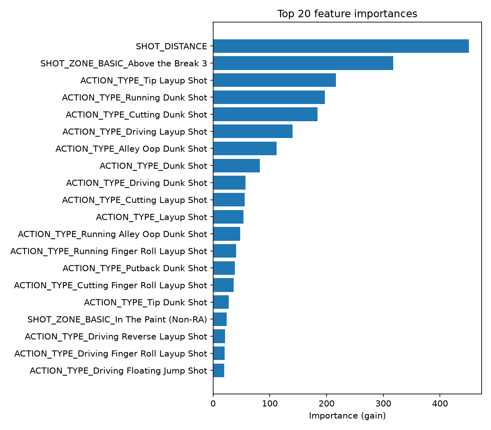

# NBA Shot Quality Model & Dashboard

A portfolio project that models NBA shot difficulty and uses it to isolate
pure shot-making skill from shot selection. For every shot attempt, an
XGBoost classifier predicts the probability it goes in (**xFG%**, "expected
field goal %") based on shot difficulty alone — distance, zone, angle,
action type, game situation — **without ever seeing who took the shot**.
Comparing a player's actual FG% to their aggregated xFG% then isolates
shooting skill from shot difficulty: two players who both shoot 45% can have
very different skill levels if one of them is taking much harder shots.

Results are served through a dark-mode, NBA.com-style Flask dashboard with
four pages: an interactive **Shot Explorer** (league/player/team hexbin shot
charts), a **Leaderboard** ranked by actual − expected FG%, a per-player
**Player Page**, and a **Methodology** page with full model transparency.

## Why this project

Built to demonstrate applied ML end-to-end — not just a notebook: real data
with real gaps, feature engineering, a metric choice defended on purpose,
honest disclosure of what the model can't see, and a shipped product on top
of it.

## Results

Trained on 2022-23 and 2023-24 seasons, evaluated on the fully held-out
2024-25 season (chronological split — never trained on the future):

| Metric | Model | Constant-prediction baseline | Improvement |
|---|---|---|---|
| Log loss | 0.6372 | 0.6914 | 7.8% |
| AUC-ROC | 0.6596 | 0.50 | — |
| Brier score | 0.2242 | 0.2491 | — |

**Log loss is the headline metric**, not accuracy — the model's raw
probabilities are shown to users directly as "expected FG%", so calibration
matters more than a binary right/wrong call.



Top features by gain are dominated by shot distance, the above-the-break-3
zone, and rim-area action types (dunks/layups) — i.e. "is this shot close to
the rim or a well-contested three" carries most of the signal, which matches
basketball intuition:



Full metrics, feature list, and training details: [`models/MODEL_CARD.md`](models/MODEL_CARD.md).

## Known data limitations (disclosed on purpose)

The public `nba_api` shot-chart endpoint does not expose true per-shot
defender distance, shot clock, or a contested-shot flag — that tracking data
isn't publicly available. Rather than pretend otherwise:

| Signal | Status | Approach |
|---|---|---|
| Shot distance, zone, angle | Real, per-shot | Used directly |
| Action type (pullup, catch-and-shoot, dunk, etc.) | Real, per-shot | Primary real proxy for contest level |
| Period, clock, home/away, score margin | Real, per-shot | Game-situation features |
| Defender distance | Not available per-shot | League-average FG% prior joined by (shot zone, distance bucket) — labeled as an approximation, not true tracking data |
| Shot clock / contested flag | Not available at all | Not used |

This distinction is also surfaced on the app's Methodology page.

## Architecture

```
Offline pipeline (pipeline/, run once, ~1-3h)
  nba_api pulls → feature engineering → chronological train/test split
  → XGBoost training + tuning → evaluation → score every shot → SQLite

Flask app (app/, read-only at runtime)
  Landing → Shot Explorer ──(pick player)──→ Player Page
          → Leaderboard ────(click player)──→ Player Page
          → Methodology (standalone reference)
```

The app **never calls `nba_api` at request time** — it only reads from a
SQLite database built once by the offline pipeline, opened `mode=ro` so a
bug in the app can never write to it. This avoids rate-limit/latency risk in
production and keeps the deployed app fast and simple.

## Tech stack

`nba_api` · pandas · XGBoost · scikit-learn · SQLite · Flask · Jinja ·
Plotly.js (interactive hexbin charts) · matplotlib (offline eval plots) ·
Render (hosting)

## Running it locally

The offline pipeline output (the trained model + populated SQLite database)
isn't committed to this repo — it's ~150MB+ and gitignored by design (see
`pipeline/README.md`). To run the app yourself, you need to build it first:

```bash
python -m venv venv && source venv/bin/activate
pip install -r requirements.txt
brew install libomp   # macOS only — XGBoost needs it

python pipeline/run_all.py   # one-time, ~1-3h, needs network access to stats.nba.com
python app/run.py            # http://localhost:5000
```

See [`pipeline/README.md`](pipeline/README.md) for the full step-by-step
pipeline breakdown (each stage is individually resumable) and
[`PRD-NBAShotQualityModel.md`](PRD-NBAShotQualityModel.md) for the full
product requirements this was built against.

## Out of scope for v1 (known backlog)

Team-level pages, head-to-head player comparison, multi-metric leaderboard
sorting, automated/periodic data refresh, mobile-optimized layout.
